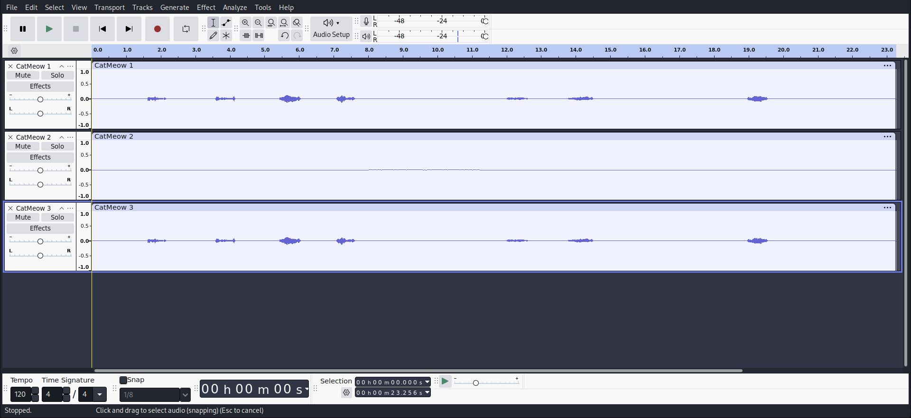
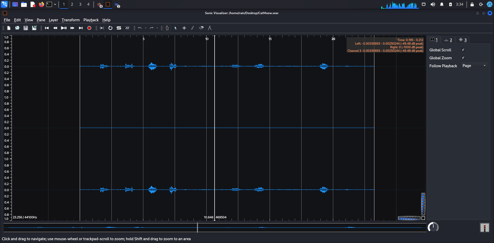
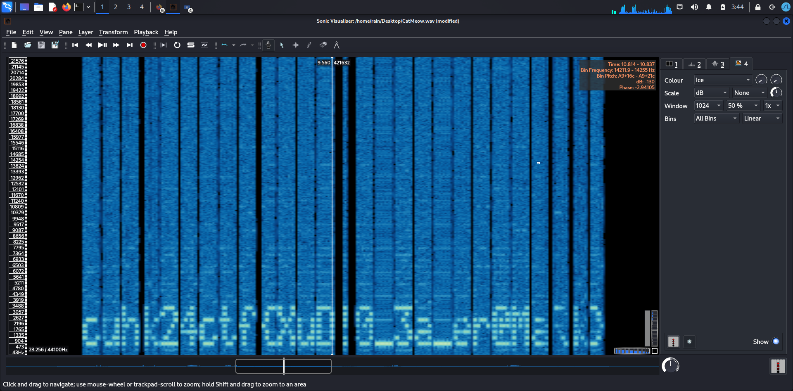

## [forens] Ho Grass Cat

What you get is a .WAV file, which is a AUDIO file.

After playing it, you will find that the file is just with "Meow" sound.

Put it in any audio editing software you like, I use Audacity here.

You can see there are three channels there, and one of them seems to have nothing. (Play them separately, and you will find that channel 1 and channel 3 are where the "Meow" sound from)(you will hear something from channel 2 only if you have good hearing)

When you open it in Sonic Visualizer (A software that use for visualization and analysis of audio files)

Click Layer -> Add Spectrogram -> select channel 2 (Since it is quite weird in the audio file). Adjust the scale, you can find something like this.

Flag: cuhk24ctf{XuD!0_3a_er@MaRk}