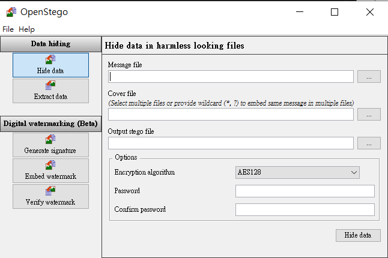
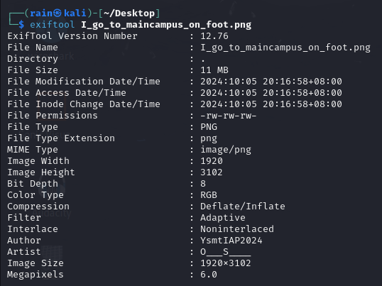
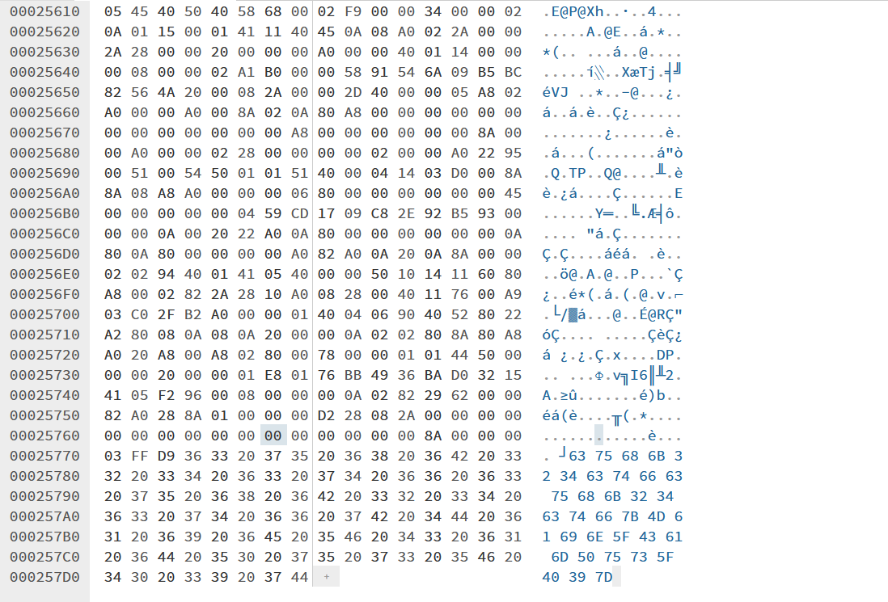
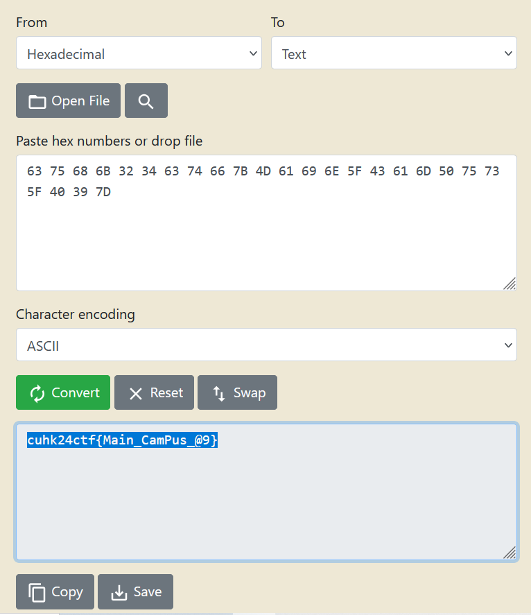

## [forens] I go to main campus on foot

For this challenge, I embedded another JPG file in the given PNG file using OpenStego with a password.

The password is hide in the metadata, "Author" tag. 

After extraction, you should get Night_of_university_mall.JPG

Open it in a Hex editor(I use HexEd.it), scroll down.
You should see some number at the end.

Put the number in Hex to ASCII converter

flag: cuhk24ctf{Main_CamPus_@9}

