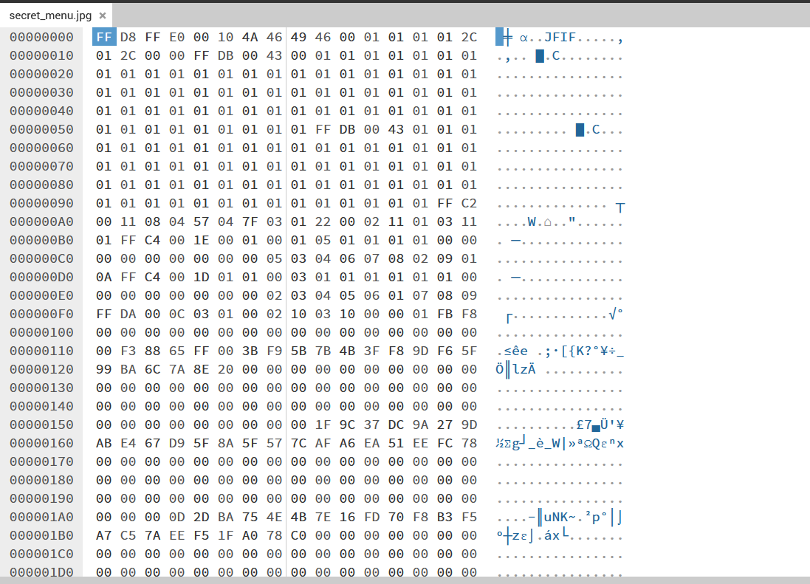

## [forens] Secret Menu

Usually, you can find some header information at the beginning of the file

1. SOI (Start of Image):  
    Hex: FF D8  
    This marker indicates the beginning of the JPEG file.  

2. APP0 (Application Segment): 
    Typically follows SOI and contains metadata about the image. 
    Hex: FF E0 (for APP0) 
    This segment can contain information such as the JFIF (JPEG File Interchange Format) version, density, and thumbnail data. 

3. DQT (Define Quantization Table): 
    Hex: FF DB 
    This segment defines the quantization tables used for compressing the image. It specifies how the image's colors are quantized. 

4. SOF0 (Start of Frame - Baseline DCT): 
    Hex: FF C0 
    This segment describes the image dimensions and color components (like YCbCr) used. 

5. DHT (Define Huffman Table): 
    Hex: FF C4 
    This segment contains the Huffman tables used for encoding the image data. 

6. SOS (Start of Scan): 
    Hex: FF DA 
    Marks the beginning of the image data (the actual compressed pixel data). 

10. EOI (End of Image)(Usually at the end of the file): 
    Hex: FF D9 
    This marker indicates the end of the image file 

You can see that the plate under the burger looks weird, seem like chopped. 
That indicate you to think of is the Height of the image get changed?

Put the secret_menu.jpg in a hex editer(hexed.it used here)

You will find that no SOF0(FF CO) found. Instead, you find FF C2 

Actually it also represent SOF but it is SOF2

Structure of SOF2
1. Marker:

    Value: FF C2 
    This indicates that the following data pertains to the SOF2 segment.

2. Length:

    Size: 2 bytes 
    This field specifies the total length of the SOF2 segment, excluding the marker itself.

3. Precision:

    Size: 1 byte 
    This field indicates the number of bits per sample, usually set to 08 for 8 bits per channel.

4. Height:

    Size: 2 bytes 
    This field specifies the height of the image in pixels.

5. Width:

    Size: 2 bytes 
    This field specifies the width of the image in pixels.

In this challenge, we have 04 57 04 74 as our height and width

04 57 is the height  
04 74 is the width

Increase the height and the flag will come out

flag: cuhk24ctf{Is_Hoi_Luk_Hung_Bou}
