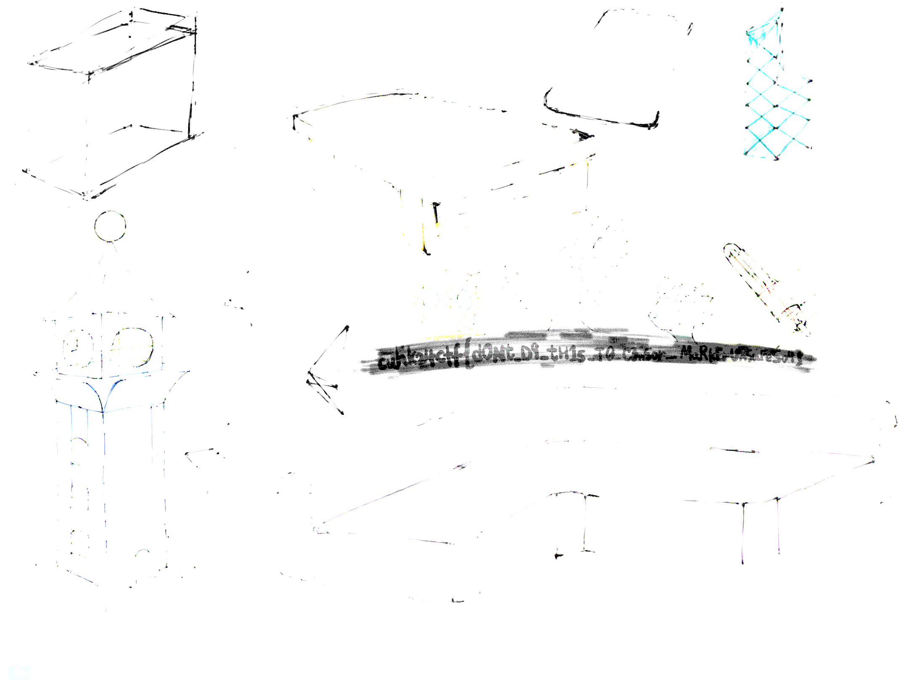
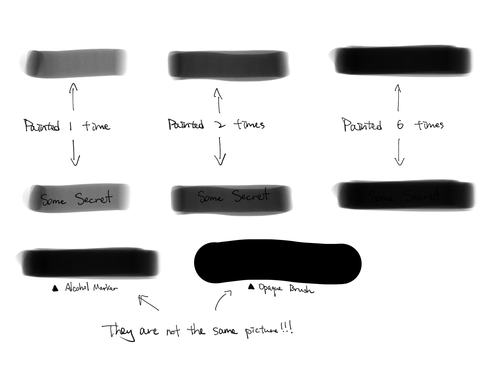
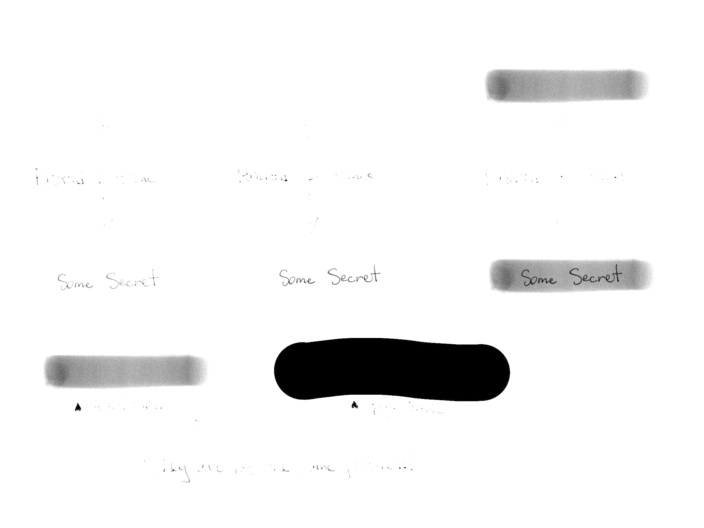

## Marker
> Author: chemistrying \
> Category: forens \
> Expected Difficulty: 2 \
> Final Points: 100 \
> Solves: 27/38 (Secondary), 25/44 (CUHK), 8/8 (Invited Teams)
> 
> I have used alchohol markers to practice sketching in Adobe Fresco, could you give me some comments about it?

Notice that there is a weirdly-covered area in the picture which is painted using alcohol markers.

If you increase the exposure of the picture to a certain level, the text that was covered by alcohol markers will be revealed.

*Given picture with increased exposure. Edited with GIMP.*

The reason behind is because alcohol markers are semi-transparent pixels paintbrush. Therefore, by painting using alcohol marker, 
it is basically adding more semi-transparent pixels to the image. When more semi-transparent pixels added together, the pixels become 
more saturated / "darker". 

*Sample illustration of using alcohol marker to censor using Adobe Fresco. Text are seem to be not visible by painting with alcohol marker 6 times*

Even though bare eyes might not be apparent to see the difference between pitch black pixels and an area painted by a black alcohol
marker 6 times, they are actually pixels with different RGB values. To be precise, the area covered by black alcohol marker 6 times has still a black colour lighter than pure black (#000000). Therefore, if one didn't cover an area with alcohol marker with "too much effort", the text underneath may become visible by increasing exposure level / a tool that can extract pixels of (text + alcohol marker) and that of alcohol marker only.

*Text under the painted-with-marker-6-times revealed with +7 exposure level. Edited with GIMP.*

*Sidenotes:
Alcohol markers have become a quite popular tool in image editing apps in smartphones. Some people use them to censor personal / important information without realising the dangers behind. They might think the personal information is not visible after censoring using markers, and then proceed to upload to social media. This will cause unintentional leakage of private information.

There are three possible ways to resolve this issue:
1. Paint harder with your alcohol markers (not recommended)
2. Use opaque brushes to censor important information
3. Just don't post private information to social media

Flag: **`cuhk24ctf{dONt_D9_tH1s_T0_C3n5or_MaRkErUnSaFeSo4}`**