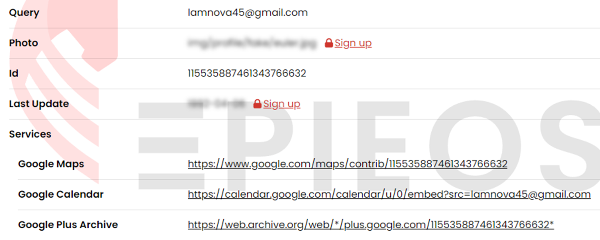
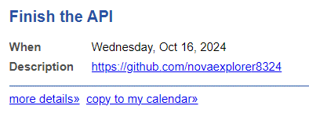
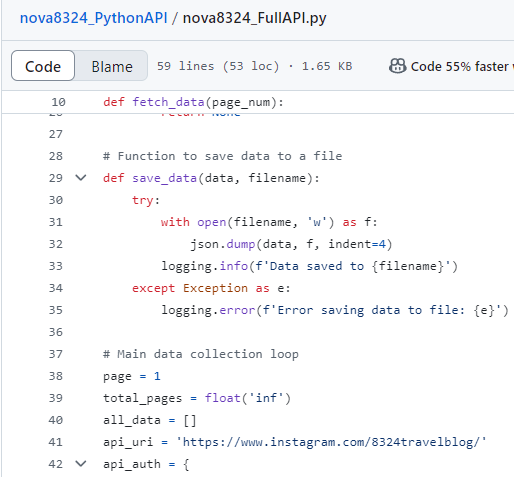
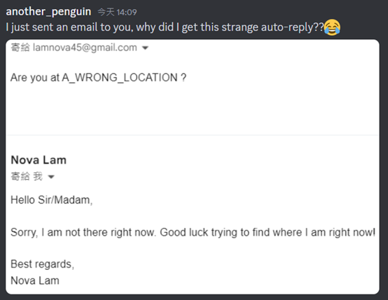
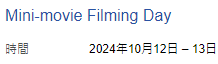
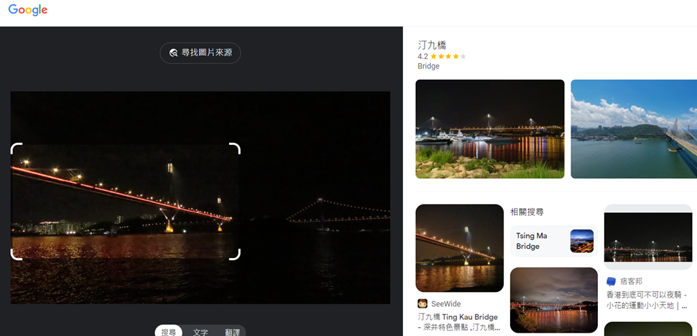
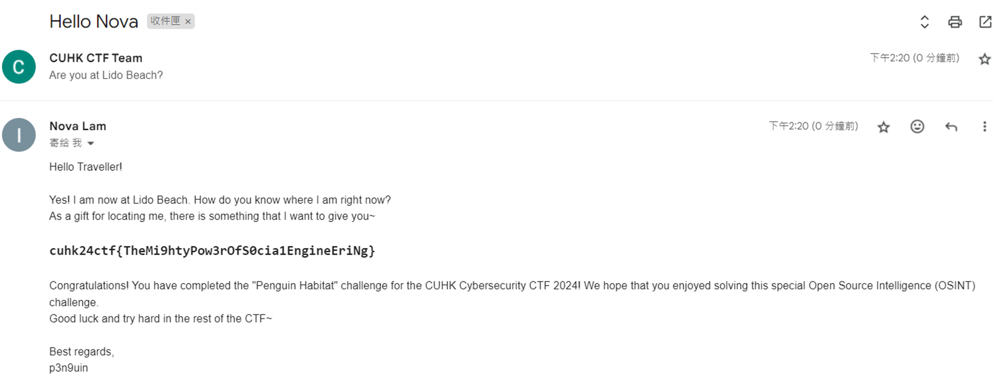

## \[misc] Penguin Habitat
> Expected Difficulty: Sophomore (Level 2)
> 
> **NOTE:**
> **This is an Open-source Intelligence (OSINT) challenge!** All information related to the flag is available on the Internet, or obtainable using free tools online.
> In the process of obtaining the flag, you are **NOT** required to physically visit any location!
> Only for this challenge, you may contact the target person and perform social engineering attack on him. **Performing social engineering attack on other people is still prohibited.**
> *If you are unsure whether your actions may violate the competition rules, you must open a support ticket on the competition's Discord server and we will assist you on that.*
> 
> Nova Lam has lost his sense of direction, and is now at the middle of nowhere. He posted [this YouTube video](https://youtu.be/xGkkfuad5Jc) at his current location. Can you locate where is he right now?

~~*OSINT player designing OSINT challenges xD*~~
So when clicking into the Youtube video link, you will be sent to an unlisted YouTube video *(and yes, you have been rickrolled)*. The channel name itself presents no clues, but if we check the page of the channel that posted the video, we can find an gmail address.

Searching this gmail address online using OSINT tools, we are able to locate a public Google Calendar.

The event on 16 October 2024, shows that Nova Lam is going to finish an API, along with a link to a Github account.

The Github account `novaexplorer8324` has a few repositories.
In the file `nova8324_FullAPI.py`, there is a link to the Instagram account `8324travelblog`.

In one of the posts on `8324travelblog`, we can observe that the screen shows a Discord message, which involve the IG account owner sending an email to Nova asking the phrase "Are you at THE_CORRECT_LOCATION ?" and getting a strange auto-reply of sort.
But where is this "correct" location?

Another post mentioned that the account owner will also be filming a mini-movie during the CTF weekend (12th and 13th October, second weekend of October). That picture consists of a night-time image of a bridge filmed from a beach, with another bridge further away. This schedule also matches Nova's schedule on that weekend.

Putting the image into Google Lens, and it should show that the bridge is Ting Kau Bridge (汀九橋). We then find the nearest beach to the bridge.

*Note:
Some search results from Google Lens may mistaken the bridge that is closer as Tsing Ma Bridge (青馬大橋).
However, if we consider the real-life orientation of the bridges (can be viewed from Google map) and in fact the photo is taken on a beach, we can confirm the bridge in question is actually Ting Kau Bridge.*

Based on the above clues, the author is now at **Lido Beach (麗都灣泳灘)**.
Send an email to the email address obtained earlier with the phrase "Are you at Lido Beach?". You should be able to receive a auto-reply email that reveals the final flag.

Flag: **`cuhk24ctf{TheMi9htyPow3rOfS0cia1EngineEriNg}`**