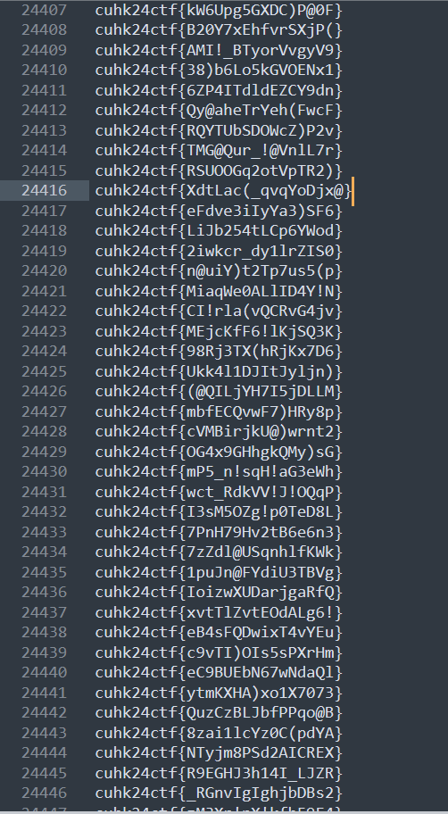

## [misc] Flags Warehouse

As you can see from the given file, there are 40000 flags in total. 

It is impossible(maybe possible) for you to analyse all the flag by eyes.

You will need a script for analysing the file.

All the flags seems to have the same length in text reader, maybe one of them has a unique length?

After running the script, you find that most of the line contain 16 charater, and one of them only have 17 charater. It seem to be the real flag.

flag: cuhk24ctf{XdtLac(_qvqYoDjx@}
