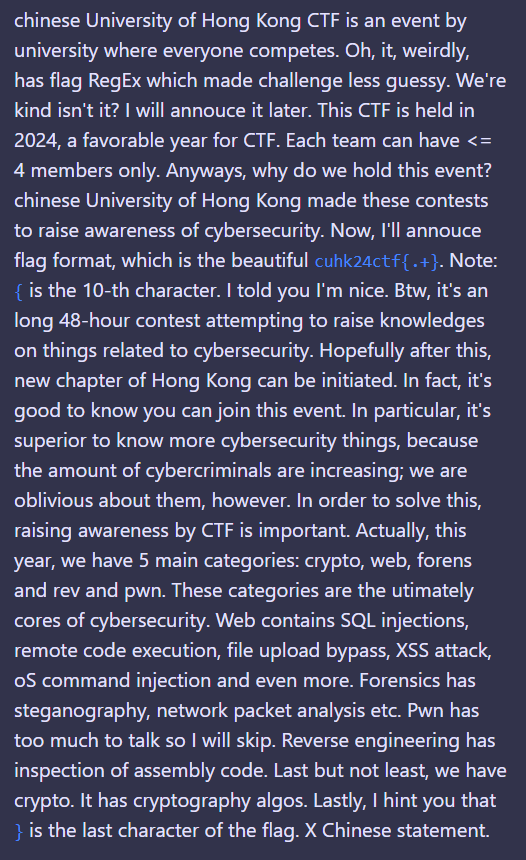

## \[misc] Resize to Win
> Author: chemistrying \
> Category: misc \
> Expected Difficulty: 1 \
> Final Points: 131 \
> Solves: 15/38 (Secondary), 12/44 (CUHK), 7/8 (Invited Teams)
> 
> chinese University of Hong Kong CTF...... (description ommitted)

Since there are no files distributed, you can notice that the flag is stored inside the description.

The title says "Resize to Win", that indicates that you have to resize something to win (aka get the flag).

Since the flag is in the description, and one of the resizable stuff is your browser window, you can try to resize it.

You can turn on inspection mode to resize the width of the page, which you will see the text automatically warps to next line if there are not enough spaces.

The description has some weird parts:
1. Some letters are lowercase letters, while it logically should be capital letters (e.g: **c**hinese University of Hong Kong, **o**S command injection)
2. Some sentences are pretty repetitive or gibberish (e.g.: "Note: `{` is the 10-th character.", "Lastly, I hint you that `}` is the last character of the flag").

Try to align these weird elements together. You will be able to see the flag. 

In fact, this is a variant of [acrostic](https://en.wikipedia.org/wiki/Acrostic). 

Flag: **`cuhk24ctf{longstoryacrostic}`**