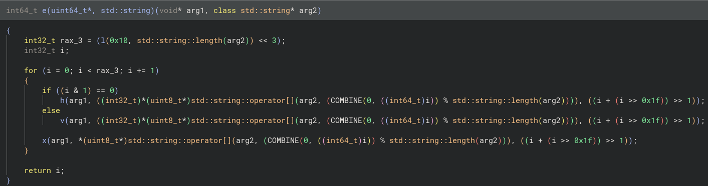

# Cryptic Tears - Writeup

> Author: [FieryRMS](https://github.com/FieryRMS) \
> Difficulty: 3/5

## Overview

We were given two files, one containing the encryption program and the other containing the encrypted file. Since no other file or service endpoints are provided, we can assume that the encrypted file contains the flag.

The encryption program takes a filename, a password, and an output filename as input.

## Analysis

When we use the program with random text files, we notice that it always rounds the length to the nearest multiple of 8. If we give anything less than 8, 8 bytes are produced. If we first give nine characters and then add one, the first eight bytes remain the same; only the last eight bytes change. We can infer from this observation that the encryption process occurs in groups of 8 bytes.

The function names have been obfuscated; at least that's what it seems like. Upon further inspection, the symbols are just the first letters of their actual names. The function `m` is the main function, `e` is the encryption function, `gi` is get input stream, `go` is get output stream, and so on.

Let's look at the encryption function, `e`:

It takes two arguments: a pointer `arg1` and a string `arg2`. It is reasonable to assume `arg2` is the password, so `arg1` must be the "group" of data.

Some sort of calculation is done using the password length and stored in `rax_3`, which is later used to loop. Looking into the `l()` function, we can see it calculates the LCM of the password length and 16, which is further multiplied by 8.

At each loop, the data alternatingly goes through `h()` and `v()` functions, then an `x()` function is applied to the data. All the parameters are the same: `data, password[i % password_length], i/2`.

Let's try to reverse the `h()` function: \
A helpful trick is to use the `Convert to NOP` feature. Most reversing tools have this feature, which converts the function to a "**N**o **OP**eration", i.e., it does nothing. To better understand the `h()` procedure, we can convert the other two functions to `NOP`s. Now that you have the encrypt function doing only one operation, you can try writing code to replicate each operation's output as you go.

Other than just using a debugger to help you inspect the values, now it's just manually reversing the function. Do the calculations on paper, and you will see that it is a circular right shift operation, or one might say a `horizontal shift` for `h()`. That means `v()` would be a `vertical shift`. That means, the 8 bytes are arranged in a block of 8x8 bits, and the `h()` and `v()` just move the bits around. You can verify this by manually reversing the `v()` function as well.

The last function, `x()`, is a simple XOR operation.

Now that we know what each function does and have an implementation, writing a decryption function is simple. Here's a brief explanation of the decryption function:

```c++
void decrypt(ull block[], string password)
{
    int rep = lcm(8 * 2, password.length()) * REPETITIONS;

    for (int i = rep - 1; i >= 0; i--)
    {
        xor(block, password[i % password.length()], i / 2);

        if (i % 2 == 0) reversed_vertical_shift(block, password[i % password.length()], i / 2);
        else reversed_horizontal_shift(block, password[i % password.length()], i / 2);
    }
}
```

For the shift functions, using `8 - shift_amount` will give us the inverse shift functions.

For the inverse XOR, we use the fact that `A ^ B ^ B = A`, so just changing the order of the operations will give us the inverse results.

Cracking the password is the final step. Since we know that the flag format starts with `cuhk24ctf{`, we know what the result of the decryption should look like. We can use this to brute force the password.

We can use a dictionary attack and use our decryption function to check if the decrypted data starts with `cuhk24ctf{`. If so, we have found the password.

The password is `ilovemyuncle`.

Use the password to get the whole flag,
`cuhk24ctf{we1L_y0u_rEv3rSeD_tHe_pR0gRaM_bUt_n0W_mY_nEpH3w_1s_g0nNa_b3_mAd_tHaT_yOu_cR4ck3d_h1s_3NcRypTi0N_bUt_1_sAy_WoMp_w0Mp_gIt_gUd_k1d_lMa0O}`

*Disclaimer: This writeup was made with 20/20 hindsight.*
